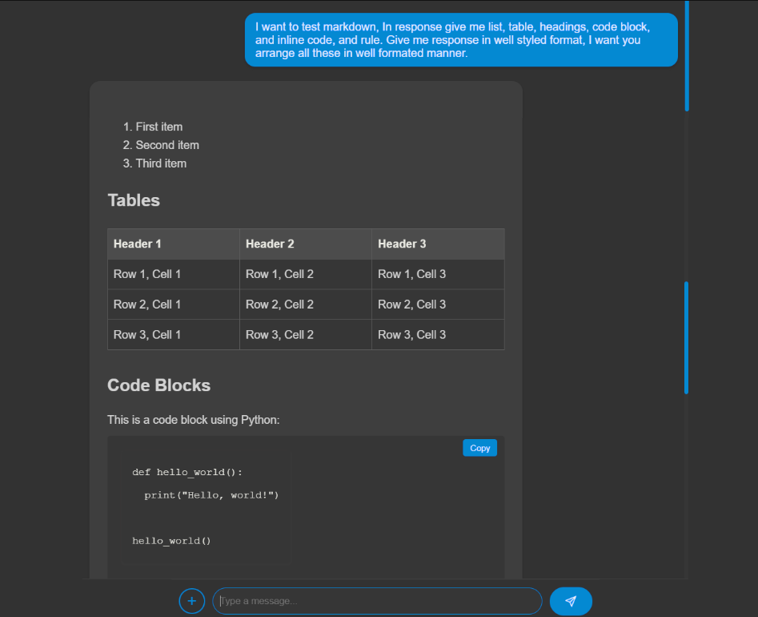

<div align="center">

# Gemini2 Model Applied Interface 🌟

</div>

Welcome to the **Gemini2 Model Interface** project! This application leverages the power of AI to analyze text and files, providing insightful responses using the [Google Generative AI](https://developers.google.com/generative-ai) API.

<div align="center">

</div>

## 🚀 Features

- **Interactive Chat Interface**
- **File Analysis**:
- **Markdown Support**
- **Code Copy Functionality**

## 🛠️ Technologies Used


## 📦 Installation

1. **Clone the repository**:

   ```bash
   git clone https://github.com/yourusername/gemini2-model.git
   cd gemini2-model-interface
   ```

2. **Install dependencies**:

   ```bash
   npm install
   ```

3. **Run the development server**:
   ```bash
   npm run dev
   ```

## 📄 Usage

- **Text Analysis**: Type your message in the input box and press enter or click the send button to get a response from the AI.
- **File Upload**: Click the `+` button to upload a file and receive an analysis.

## 🤝 Contributing

We love contributions! If you're interested in contributing to this project, please follow these steps:

1. **Fork the Repository**: Click `Fork` button at the **top-right corner** of this repository's page to create copy for **your GitHub account**.

2. **Clone Your Forked Repo**: Clone the forked repository to your local as follows:

   ```bash
   git clone https://github.com/yourusername/gemini2-model-interface.git
   cd gemini2-model-interface
   ```

3. **Create a Branch**: Create a new branch for your feature or bug fix:

   ```bash
   git checkout -b feature/<your-feature-name>
   ```

4. **Make Your Changes**: Implement your changes or additions in the codebase. Make sure to follow the existing code style and conventions.

5. **Commit Your Changes**: Commit your changes with a clear and descriptive commit message:

   ```bash
   git add .
   git commit -m "[feat] <detail about your-feature>"
   ```

6. **Push to Your Fork**: Push your changes to your forked repository:

   ```bash
   git push origin feature/<your-feature-name>
   ```

7. **Create a Pull Request**: Click the `New Pull Request` button. Select your branch, **provide a detailed description,** and submit the **pull request**.

## 📜 License

This project is licensed under the MIT License.

## 📧 Contact

For any inquiries, please contact [mycomputer2214@gmail.com](mailto:mycomputer2214@gmail.com).

---

<div align="center">

Made with ❤️ by [ARslan Ahmad](https://github.com/arslan-ahm)

</div>
